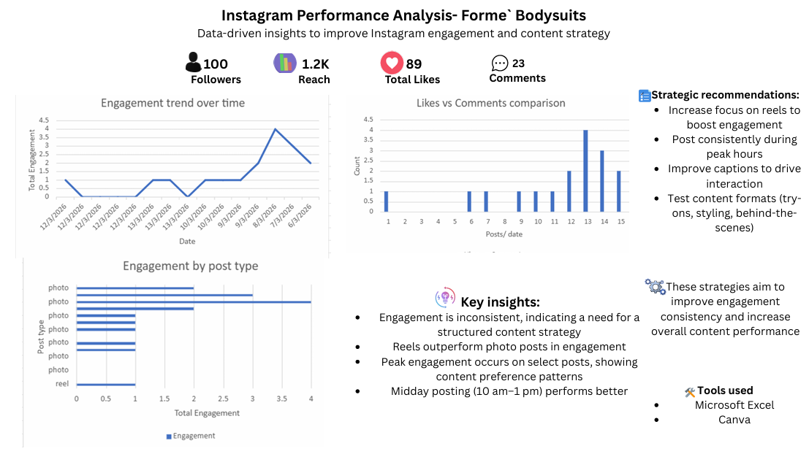

# Instagram Performance Analysis – Forme Bodysuits

## 🚀 Overview
This project analyzes Instagram performance for a fashion brand to identify engagement gaps and provide actionable strategies to improve content performance, consistency, and audience growth.

---

## 🎯 Business Objective
To evaluate current Instagram performance and recommend data-driven strategies that can increase engagement consistency and improve content effectiveness.

---

## 📊 Key Findings
- Engagement is inconsistent, indicating the need for a structured content strategy  
- Reels outperform photo posts in overall engagement  
- Peak engagement occurs on specific content types, showing clear audience preferences  
- Midday posting (10am–1pm) generates higher engagement  

---

## 📈 Recommendations (Actionable) 
- Increase focus on short-form video (Reels) to maximize reach and engagement  
- Maintain a consistent posting schedule during peak engagement hours  
- Improve captions with clear calls-to-action to drive interaction  
- Test content formats such as try-ons, styling videos, and behind-the-scenes content  

## 📊 Expected Impact
- Improved engagement consistency across posts  
- Increased reach through optimized content formats  
- Higher interaction rates from better posting timing and captions 

## 🧠 What This Demonstrates
This project highlights my ability to:

- Analyze social media performance data  
- Identify trends and audience behavior patterns  
- Develop actionable content strategies  
- Present insights in a clear, client-ready format  

---

## 🛠 Tools Used
- Microsoft Excel – data cleaning, analysis, and visualization  
- Canva – dashboard design and presentation of insights  
---

## 📂 Deliverables
- Excel dataset and analysis  
- Visual performance report (Canva dashboard)  

---

## 💼 Value to a Business
This type of analysis can help businesses:
- Understand what content performs best  
- Improve engagement rates  
- Make better content decisions  
- Build a more consistent and effective social media strategy

- ## 💼 What This Demonstrates
Ability to analyze social media performance data and translate insights into actionable strategies that drive engagement and content growth.

---

## 📬 Contact
Open to opportunities in social media management, digital marketing, and content strategy.
